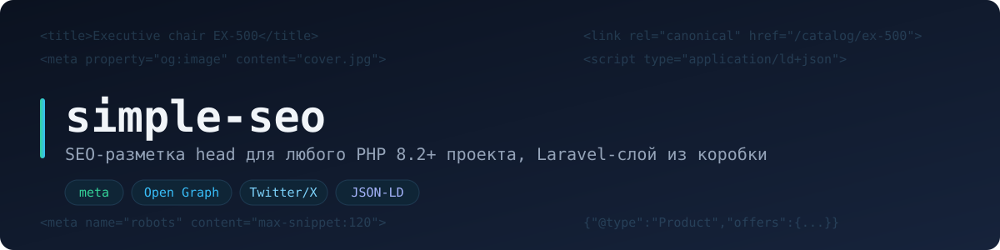

# seotools

Meta-теги, Open Graph, карточки Twitter/X и JSON-LD для PHP 8.2+. Ядро без зависимостей, слой для Laravel 11/12 в том же пакете.

Я написал этот пакет на замену artesaos/seotools в своих проектах. Из старого пакета взята только идея, реализация и API новые. Две вещи, которые меня в нём раздражали, здесь устроены иначе:

Дефолты из конфига не липнут к странице. Они подставляются при рендере, если страница ничего не задала. Не нужен хак `setDescription(false)`, есть честный `withoutDefaults()`.

JSON-LD собирается коллекцией. Каждый `add()` это отдельная сущность, две и больше склеиваются в `@graph`. Нет "текущего блока", который можно случайно перетереть вызовом из другого места шаблона.

Остальное по мелочи: скалярные сеттеры заменяют значение, списочные накапливают, robots задаётся методами `noindex()` / `maxSnippet(120)` вместо строки, весь вывод экранирован, JSON-LD кодируется с защитой от закрывающего script-тега. PHPStan на максимальном уровне, поведение закрыто тестами.

## Установка

```bash
composer require timur-turdyev/seotools
```

В Laravel провайдер и фасад подхватятся сами. Конфиг с дефолтами публикуется по желанию:

```bash
php artisan vendor:publish --tag=seotools-config
```

## Laravel

```php
seo()->title('Кресло руководителя EX-500')
    ->description('Эргономичное кресло с кожаным сиденьем.')
    ->image('https://example.com/chair.jpg')
    ->canonical('https://example.com/catalog/chairs/ex-500');
```

В layout, в head:

```blade
@seo
```

Верхний уровень раскидывает значения сам: `title()` заполняет meta, og и twitter разом, `canonical()` дублируется в `og:url`, `image()` уходит в og и twitter. Когда нужен контроль, спускайся в секцию:

```php
seo()->meta()->noindex()->maxSnippet(120)->alternate('ru', 'https://example.com/ru');
seo()->openGraph()->type('article')->property('article:published_time', $date);
seo()->twitterCard()->card(TwitterCardType::SummaryLargeImage)->creator('@author');
seo()->jsonLd()->add(['@type' => 'WebSite', 'name' => 'Example']);
```

Секция twitter молчит, пока страница не задаст явное значение: X умеет читать og-теги, дублировать их незачем.

Модель может описать свою разметку сама через контракт `HasSeo`:

```php
final class Product extends Model implements HasSeo
{
    public function toSeo(): SeoData
    {
        return new SeoData(
            title: $this->name,
            description: $this->summary,
            image: $this->cover_url,
            canonical: route('products.show', $this),
            ogType: 'product',
            jsonLd: [Schema::product()->name($this->name)->sku($this->sku)],
        );
    }
}
```

Тогда в контроллере остаётся одна строка:

```php
seo()->apply($product);
```

При `app.debug` директива дописывает html-комментарий: какое поле пришло со страницы, какое из конфига. Сами значения не светятся.

## Вне Laravel

Хелпера `seo()` и директивы тут нет, остальной API тот же. Собери менеджер при бутстрапе:

```php
use TimurTurdyev\Seotools\JsonLd\JsonLdBuilder;
use TimurTurdyev\Seotools\Meta\MetaBuilder;
use TimurTurdyev\Seotools\OpenGraph\OpenGraphBuilder;
use TimurTurdyev\Seotools\SeoManager;
use TimurTurdyev\Seotools\TwitterCard\TwitterCardBuilder;

$seo = new SeoManager(
    new MetaBuilder(defaultTitle: 'Мой сайт', titleSuffix: ' - Мой сайт'),
    new OpenGraphBuilder(defaultSiteName: 'Мой сайт', defaultType: 'website', defaultLocale: 'ru_RU'),
    new TwitterCardBuilder(),
    new JsonLdBuilder(),
);
```

В шаблоне:

```php
<head>
    <?= $seo->render() ?>
</head>
```

Вывод экранирован, оборачивать не нужно.

Под PHP-FPM больше ничего не требуется. Под RoadRunner, Swoole и в прочих воркерах вызывай `$seo->reset()` между запросами или создавай свежий инстанс. В Symfony и Yii регистрируй фабрику в контейнере и бери дефолты из своего конфига. Классы из `src/Laravel/` в таких проектах не загружаются, функция `seo()` объявлена через `function_exists` и никому не мешает. В Laravel менеджер привязан как scoped, Octane сбрасывает его сам.

## Схемы JSON-LD

Готовые билдеры: Product, Offer, AggregateOffer, AggregateRating, Article, BlogPosting, Person, BreadcrumbList, Organization, WebSite, LocalBusiness.

```php
use TimurTurdyev\Seotools\JsonLd\Schema\Schema;

seo()->jsonLd()->add(
    Schema::product()
        ->name('EX-500')
        ->offers(Schema::offer()->price('49900.00')->priceCurrency('RUB')->inStock())
);

seo()->jsonLd()->add(
    Schema::breadcrumbs()
        ->item('Главная', 'https://example.com')
        ->item('Каталог', 'https://example.com/catalog')
        ->item('Кресла')
);
```

Позиции хлебных крошек нумеруются сами. Под типы, которые Google перестал показывать (FAQ и подобные), билдеров нет: экзотику передавай массивом или через `->property()`.

## Миграция с artesaos/seotools

Таблица соответствий вызовов, маппинг конфига и отличия поведения: `docs/migration-from-artesaos.md`.

## Разработка

```bash
composer test
composer analyse
composer lint
```

Лицензия MIT.

## English

Meta, Open Graph, Twitter/X cards and JSON-LD for PHP. Plain PHP 8.2+ core with zero runtime deps, lazy Laravel 11/12 layer in the same package. Config values resolve as render-time fallbacks, every `jsonLd()->add()` is an independent entity, robots directives are typed methods, output is escaped. Install via composer, set page values with `seo()`, print with `@seo` or `$seo->render()`. Migration notes live in `docs/migration-from-artesaos.md`.
